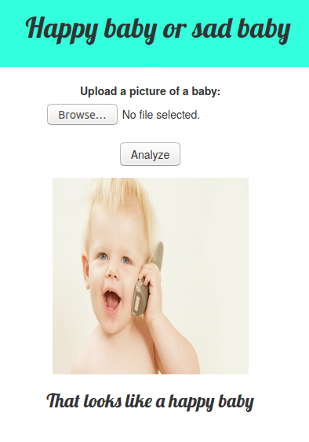
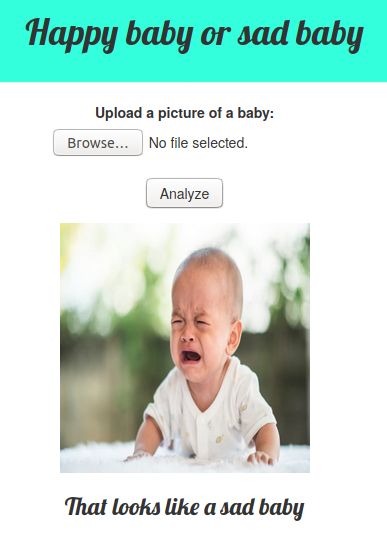

# Happy baby or sad baby

The suggested practice for Lesson 2 of the fastai course v3 was to build a web app to classify images. I created an app that tells you if a baby looks happy or sad using Flask and deployed it on Heroku. 

- Here is the link for the app: (https://happy-baby-or-sad-baby.herokuapp.com/).
- This model was trained on images downloaded from Google images, the urls used are in the files `urls_happy.csv` and `urls_sad.csv`. After cleaning the images using fastai, the urls for the cleaned data were saved in the file `cleaned.csv`. 
- The full training process is documented in `baby_classifier_notebook.ipynb`.
- The code for the app is in `baby_classifier_app.py`.

# Examples

